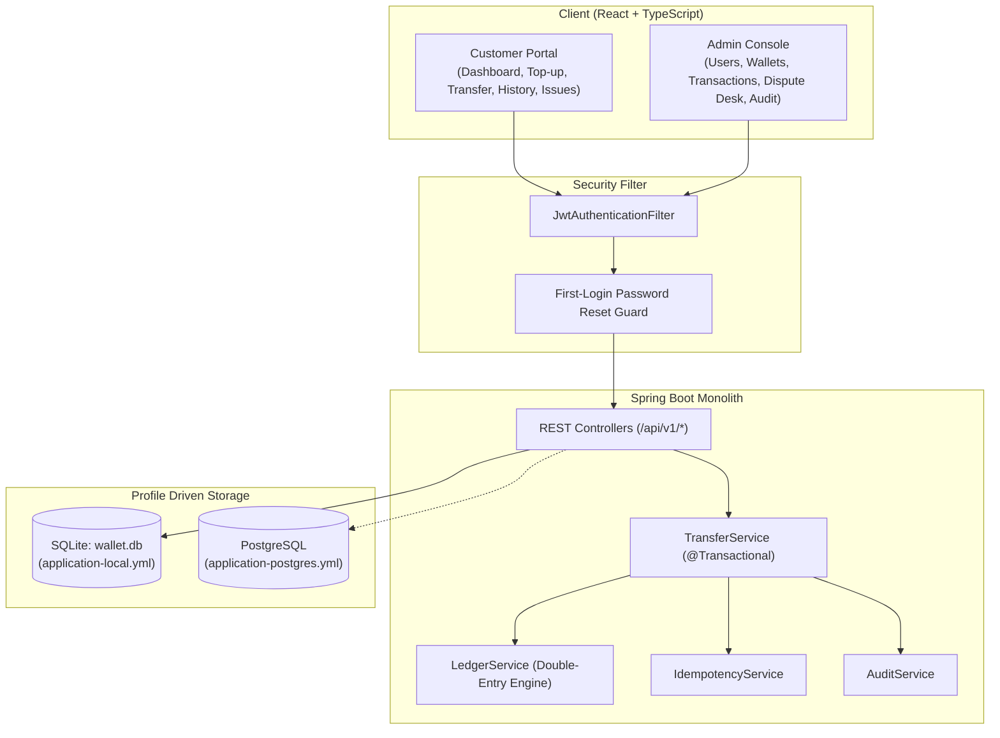

# PayCore — Enterprise Wallet Based Transaction System

A secure, enterprise-grade **Wallet Based Transaction System** built with **Java 21**, **Spring Boot 3**, **React + TypeScript (Vite)**, and a database-portable architecture running on **SQLite** for local development and zero-code-change ready for **PostgreSQL** in production or Docker Compose.

---

## 1. Key Engineering Highlights & Invariants

1. **Double-Entry Bookkeeping Ledger**:
   - Every financial transaction produces balanced, immutable debit and credit ledger rows (`SUM(DEBITS) == SUM(CREDITS)`).
   - Top-ups debit a system clearing account (`SYS_CASH_GATEWAY`) and credit the customer's wallet.
   - User-to-user transfers debit the sender and credit the receiver atomically inside `@Transactional`.
2. **Immutable Ledger Entries**:
   - `LedgerEntry` rows are strictly append-only. JPA lifecycle callbacks (`@PreUpdate`, `@PreRemove`) reject any modification or deletion attempts.
3. **Deadlock-Free Balance Locking**:
   - Concurrent transfers between identical pairs in reverse order (User A $\to$ User B and User B $\to$ User A) acquire pessimistic write locks ordered by ascending primary key (`Math.min(idA, idB)` followed by `Math.max(idA, idB)`).
4. **Idempotency Guarantee**:
   - Financial endpoints accept an optional `Idempotency-Key` header. Requests are recorded in the `idempotency_keys` table. Replays return the cached response without duplicate money movements.
5. **Mandatory First-Login Password Reset**:
   - Newly created user accounts have `passwordResetRequired = true`. Security filters restrict wallet operations until the password is changed.
6. **Complete Audit Trail**:
   - All credential updates, status toggles, top-ups, transfers, and dispute changes are recorded in the `audit_logs` table.
7. **Dispute & Issue Management Desk**:
   - Customers can dispute transactions directly from their transaction feed. Administrators can review, assign status (`OPEN` $\to$ `IN_PROGRESS` $\to$ `RESOLVED`), and attach resolution notes.

---

## 2. Technology Stack

- **Backend**: Java 21, Spring Boot 3.4.1, Spring Security, Spring Data JPA, Hibernate Community Dialects (SQLite), PostgreSQL Driver, jjwt 0.12.6, Springdoc OpenAPI 2.8.3, Lombok, JUnit 5, Mockito.
- **Frontend**: React 18, TypeScript, Vite, Tailwind CSS, Lucide React, Axios.
- **Databases**: SQLite (local `wallet.db`), PostgreSQL 16 (via profile).
- **Containerization**: Multi-stage Dockerfiles and Docker Compose.

---

## 3. Architecture Overview



---

## 4. Quickstart: Running Locally

### Prerequisites
- **Java 21 JDK**
- **Apache Maven 3.9+**
- **Node.js 18+ and npm**

### 1. Start Spring Boot Backend (SQLite by default)
```bash
cd backend
mvn clean spring-boot:run
```
- Starts on `http://localhost:8080`.
- Creates SQLite database `wallet.db` automatically.
- Seeds default Admin, System Treasury, and demo users.
- Swagger UI available at: `http://localhost:8080/swagger-ui/index.html`.

### 2. Start React Frontend
```bash
cd frontend
npm install
npm run dev
```
- Open `http://localhost:5173` in your browser.

---

## 5. Pre-Seeded Test Credentials

| Role | Email | Password | Initial Balance | Notes |
| :--- | :--- | :--- | :--- | :--- |
| **Admin** | `admin@wallet.local` | `Admin@123` | ₹0.00 | Full administrative and audit access |
| **Customer** | `alice@wallet.local` | `User@123` | ₹5,000.00 | Ready for transfers and top-ups |
| **Customer** | `bob@wallet.local` | `User@123` | ₹3,000.00 | Ready for transfers and top-ups |
| **Customer** | `carol@wallet.local` | `Temp@123` | ₹0.00 | **First-login password reset demo** |

---

## 6. Docker & PostgreSQL Deployment

To run the complete application stack (React Frontend + Spring Boot Backend + PostgreSQL 16) with Docker Compose:

```bash
docker-compose up --build
```

- **Frontend**: `http://localhost`
- **Backend API**: `http://localhost:8080`
- **PostgreSQL**: `localhost:5432` (database `walletdb`)

---

## 7. Running Automated Tests

Run the full suite of unit, integration, and accounting invariant tests:

```bash
cd backend
mvn clean test
```
